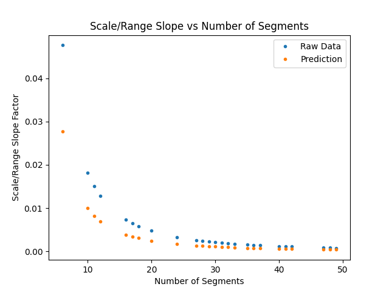

# Looking at Results of Long Solve Method for 250,000 Unique Input Combinations
250,000 test cases were generated using the Long Solve method. This involved 10,000 random range sizes from 100 - 1,000,000 paired with 25 different random choices for number of segments (possible values were 5 - 50).

Charting the scale factors generated vs the range size for these 250,000 cases shows a linear relationship between range size and scale factor.  
  
Each different color in the above graph represents scale factor vs range size for only one choice of number of segments. From this, we can deduce that there must be some relationship between the number of segments and the slope of scale factor vs range size.  
  

If you've spent some (a lot of) time looking at numbers, you might recognize that shape. It looks just a bit like $1 \over x^2$. If we take a look at the above graph overlayed with a chart of $1 \over x^2$, we can see their very similar.  
  
And if we plot the cross-section of our predictions and the actual value found by the Long Solve method, we see a straight line  
  
with a slope of (1.69 $\pm$ 0.01). This tells us that the relationship between the number of segments and the scale\range slope is $(1.69 \pm 0.01) \over (number\ of\ segments)^2$.  
From here, we can subsitute the prediction for the slope of scale/range into the relationship of scale vs range, or $(1.69 \pm 0.01)\ \dot \ \ Range \over (number\ of\ segments)^2$.  
This equation does yeild close results for predicting the actual value, but they have an unsatisfying standard deviation of 200 - too large to yeild accurate predictions.
